# Actividad Unidad 5 - Automatización de la Configuración: Ansible

En sesiones anteriores desplegamos la aplicación `store-app` con base de datos PostgreSQL en Kubernetes. Ahora usaremos **Ansible** para automatizar tareas de **administración** sobre los nodos que soportan un clúster Kubernetes donde está desplegada la aplicación `store-app` con tres réplicas y una base de datos``PostgreSQL`


**Índice**

[Objetivos](#objetivos)

[Infraestructura y herramientas a utilizar](#infraestructura-y-herramientas-a-utilizar)

[Instalar Ansible en equipo local](#instalar-ansible-en-equipo-local)

[Comprobar y configurar ssh](#comprobar-y-configurar-ssh)

[Crear inventario Ansible](#crear-inventario-ansible)

[Análisis Ansible](#análisis-ansible)

[Ejecutar módulos Ansible](#ejecutar-módulos-ansible)

[Organización de proyectos en Ansible](#organización-de-proyectos-en-ansible)

[Roles](#roles)

[Dejando todo en órden](#dejando-todo-en-órden)

---
# OBJETIVOS

- Crear inventarios dinámicos y estáticos en Ansible.
- Desarrollar playbooks con tareas de configuración, verificación y reporting.
- Aplicar principios de idempotencia y buenas prácticas de automatización.
- Vincular Ansible con entornos Kubernetes para operaciones de mantenimiento.

---
# INFRAESTRUCTURA Y HERRAMIENTAS A UTILIZAR.

**Infraestructura Técnica Integrada**

LABORATORIO :  

    TU MÁQUINA LOCAL
    ├── minikube profile "ansible"
    │   ├── ansible  ← control-plane 
    │   ├── ansible-m02  ← pods store-app 
    │   └── ansible-m03  ← PostgreSQL
    | 
    └── Nodo Ansible externo (tu MV kali)
        └── SSH → workers para automatizar configs
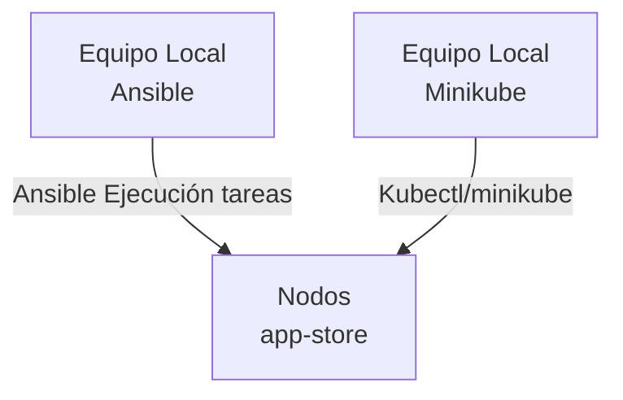
```mermaid
flowchart TB
    
A["Equipo Local<br/>Minikube"]   
B["Equipo Local<br/>Ansible"]
C["Nodos<br/>app-store"]
   
   
B -->| Ansible Ejecución tareas| C
A -->|Kubectl/minikube| C
    

```

**Componentes de la Infraestructura**


| Componente   | Función              |  
| ------------ | -------------------- |  
| Kubernetes   | Automatización del despliegue  |  
| Ansible      | Automatización y gestión de la configuración  |   
| Minikube     | Cluster de Kubernetes Local       |   


---
# PREPARANDO EL LABORATORIO


1. **Creamos una carpeta** para la actividad:

```bash
# crea carpeta donde vas a realizar 
mkdir -p Actividad-Ansible
# copiar los archivos de la actividad de kubernetes
# cp -rp Actividad_despliegue_app_store/* Actividad-Ansible/
# colocarse en la carpeta
cd Actividad-Ansible
```
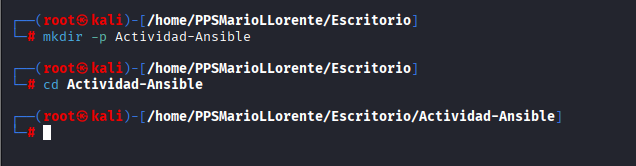

2. Descomprimimos la aplicación.

```bash
# coloca store-app.zip en la carpeta
# descomprime 
unzip store-app-postgree.zip 
# mover los archivos a la carpeta actual y eliminar la carpeta y el zip
mv store-app-postgree/* ./
rm -rf store-app-postgree*
cd store-app

```
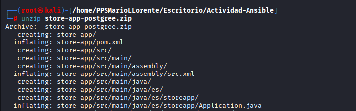

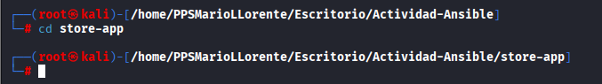

3. **Descargar** en la carpeta los archivos:
- Dockerfile
- store-app-k8s.yaml

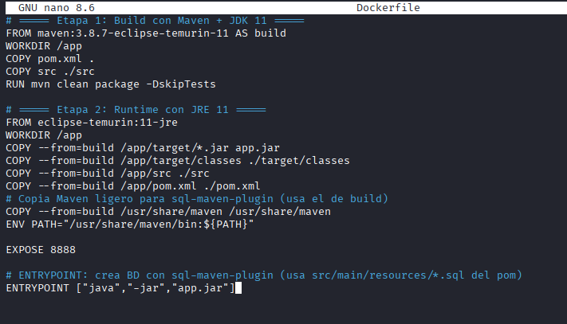

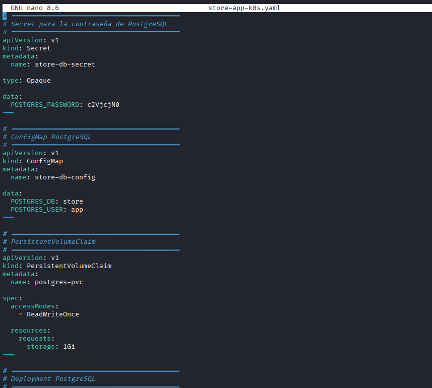

2. **Comprobar si está kubectl instalado**:

```bash
kubectl version --client=true
```
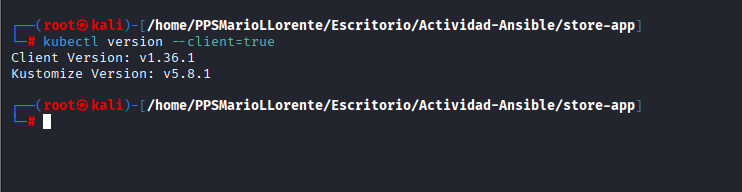

5.  **Iniciar `minikube`**.
```bash
# Iniciar un clúster de 3 nodos
minikube start --nodes 3 -p ansible
# -p ansible es el nombre del perfil (puedes elegir otro).
# Verifica los nodos creados
kubectl get nodes
```
Esto **crea un clúster** con:

- 1 nodo de control (ansible)
- 2 nodos workers (ansible-m02, ansible-m03)

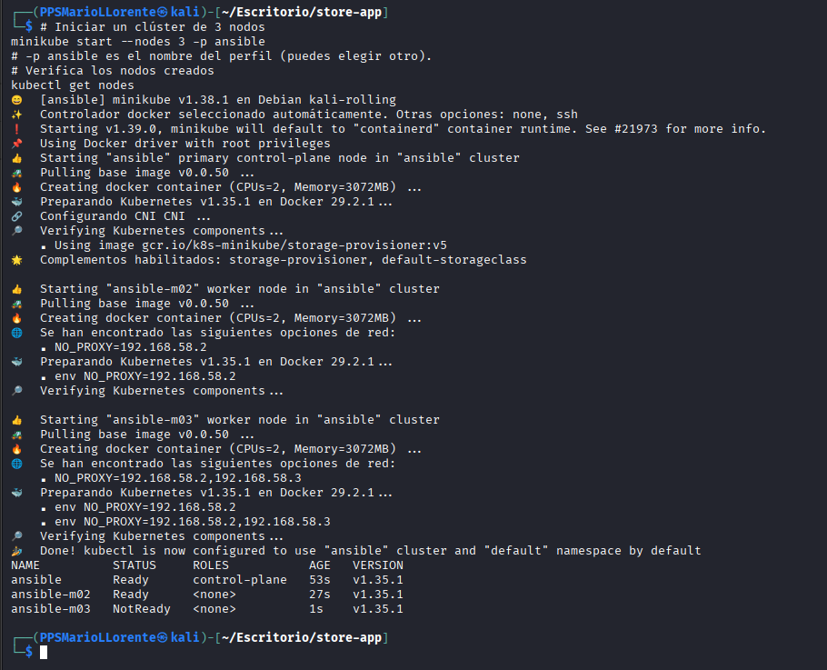

6. **Etiquetar los nodos**: vamos a etiquetar los nodos para que los pods `store-app` se desplieguen en el nodo `ansible-m02` y el `store-db` en el nodo `ansible-m03`. 


```bash
# Etiquetar worker2 para aplicación
kubectl label nodes ansible-m02 app-role=frontend

# Etiquetar worker3 para base de datos  
kubectl label nodes ansible-m03 app-role=backend

# Verificar etiquetas
kubectl get nodes --show-labels
```
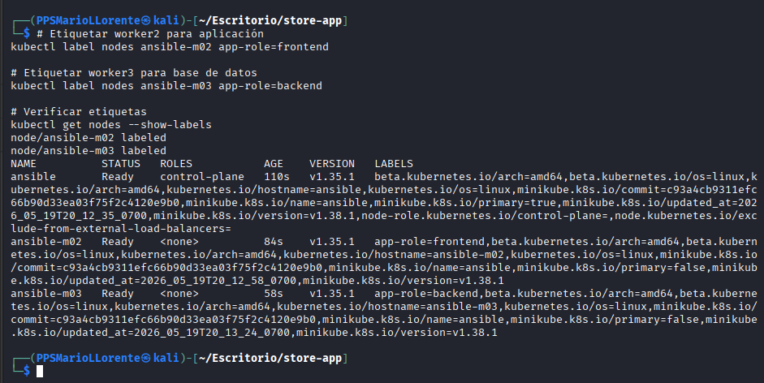

6. **Configurar docker de `minikube, construir imágen y aplicar el despliegue**:

```bash
# Construye imagen store-app preparado para postgree
docker build -t store-app:latest .
# cargamos la imagen en el contesto ya que sino sólo está en el nodo de control
minikube image load store-app:latest --profile=ansible
# aplica manifiesto kubernetes de despliegue
kubectl apply -f store-app-k8s.yaml  
# esperamos unos minutos que se despliegue todo
sleep 100
# obtenemos información de kubectl
kubectl get all
# consultamos la información de pods y vemos que se han creado en los nodos correspondientes 
kubectl get pods -o wide
# Ejecutamos servicio minikube para que nos muestre la dirección de la aplicación.
minikube service store-app --url -p ansible
# esperar que tarda unos minutos en arrancar todo el despliegue
# mientras tanto queda el terminal ocupado y trabajando en segundo plano
# cuando termine nos muestra la dirección del NodePort de Minikube 
```
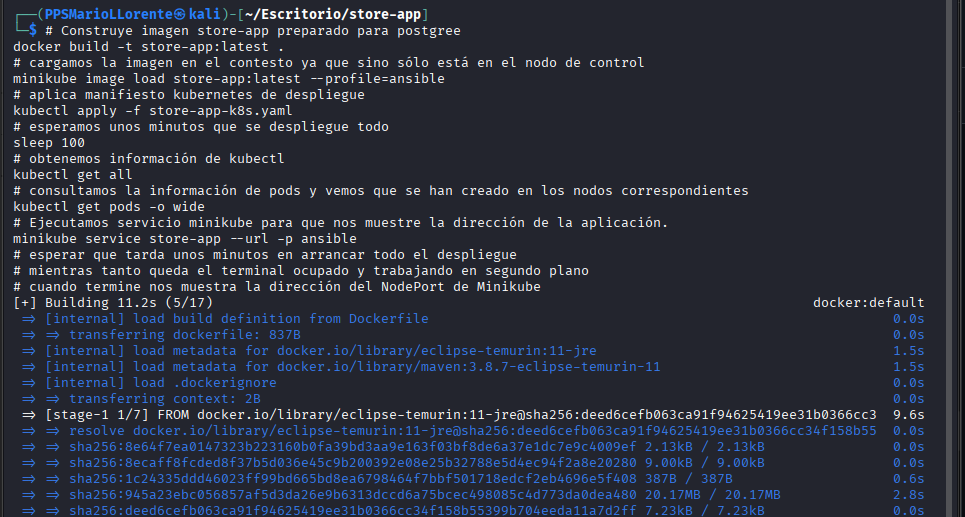

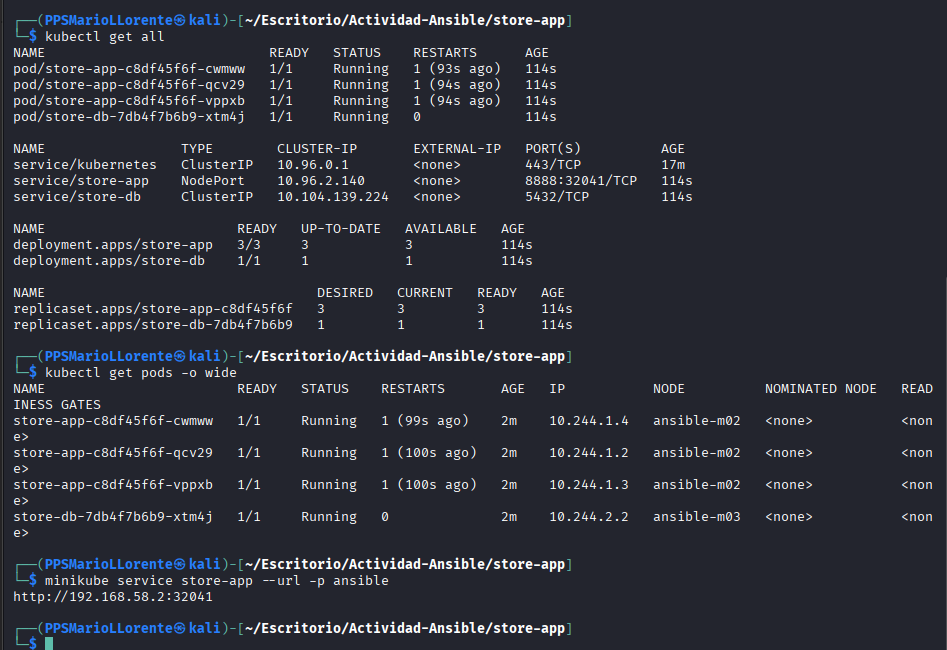

7. Comprobar que aplicación funciona.

Acceder a la dirección del `NodePort` de Minikube proporcionada. En mi caso: http://192.168.58.2:32041

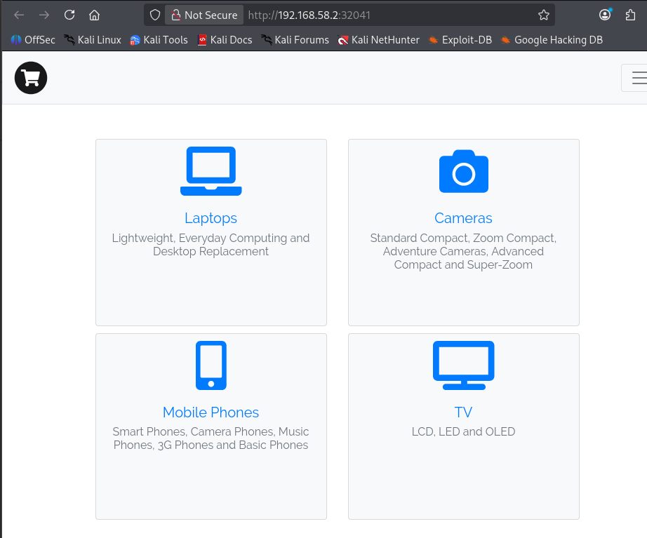

---
# INSTALAR ANSIBLE EN EQUIPO LOCAL

1. Instalar `Ansible` en nuestra máquina:
```bash
sudo apt update
sudo apt install software-properties-common
sudo add-apt-repository --yes --update ppa:ansible/ansible
sudo apt update
sudo apt install ansible
 # Verificar que se ha instalado
ansible --version  
```
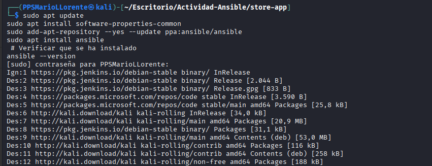

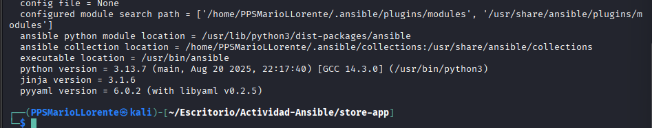

---
# COMPROBAR Y CONFIGURAR SSH

`Minikube` crea una red interna automáticamente que nos va a permitir conectarnos automáticamente por SSH con los workers.

1. Verificar acceso. A los workers de `Minikube` deberíamos tener acceso:

```bash
# SSH a workers (¡funciona ya!)
minikube ssh --node m02 --profile=ansible
# exit para salir
```

Vemos como hemos podido acceder dentro del worker m02

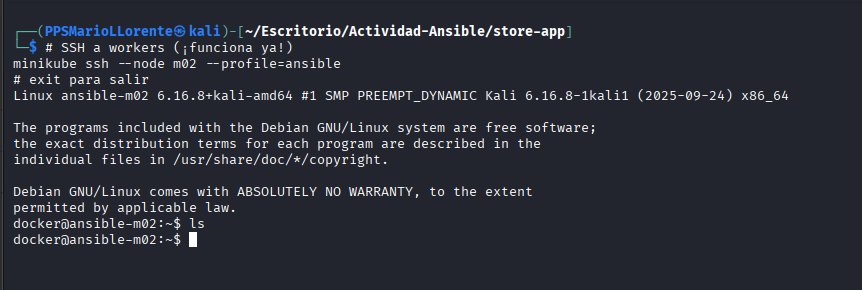

2. Comprobar también en el nodo m03 y en el nodo control:

```bash
minikube ssh --node m03 --profile=ansible
#exit  para Salir
minikube ssh  --profile=ansible
#exit  para Salir

```
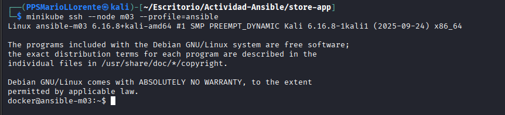

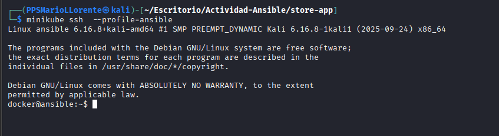

3. **Configurar SSH sin contraseña**. Para ello establecemos una **relación de confianza** entre nuestro equipo y cada uno de los nodos, así nos podremos conectar con ansible por ssh con cada uno de ellos.

```bash
# 1. Generar clave SSH en TU HOST
ssh-keygen -t ed25519 -C "ansible-lab" -f ~/.ssh/minikube_key

# 2. Copiar clave a workers
# entrar en  Workers y crear carpeta .ssh
minikube ssh  --profile=ansible 'mkdir -p ~/.ssh && cat >> ~/.ssh/authorized_keys' < ~/.ssh/minikube_key.pub
# pulsar Ctrl + C que se queda enganchado
minikube ssh --node m02 --profile=ansible 'mkdir -p ~/.ssh && cat >> ~/.ssh/authorized_keys' < ~/.ssh/minikube_key.pub
# pulsar Ctrl + C que se queda enganchado
minikube ssh --node m03 --profile=ansible 'mkdir -p ~/.ssh && cat >> ~/.ssh/authorized_keys' < ~/.ssh/minikube_key.pub
# pulsar Ctrl + C que se queda enganchado

# 3. Probar conexión al nodo de control y los workers
ssh -i ~/.ssh/minikube_key docker@$(minikube ip  --profile=ansible)
# escribir yes cuando haga pregunta de si queremos conectar y añadir a authorized.
# exit para salir
ssh -i ~/.ssh/minikube_key docker@$(minikube ip --node m02 --profile=ansible)
# escribir yes cuando haga pregunta de si queremos conectar y añadir a authorized.
# exit para salir
ssh -i ~/.ssh/minikube_key docker@$(minikube ip --node m03 --profile=ansible)
# escribir yes cuando haga pregunta de si queremos conectar y añadir a authorized.
# exit para salir
```
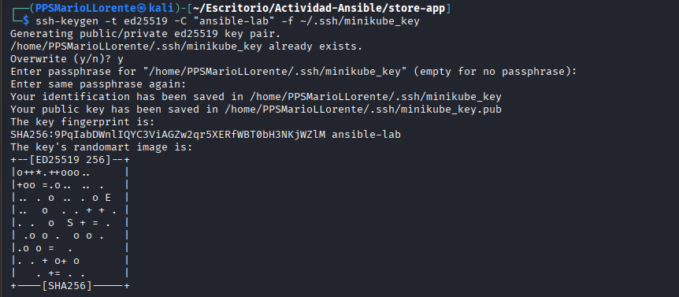

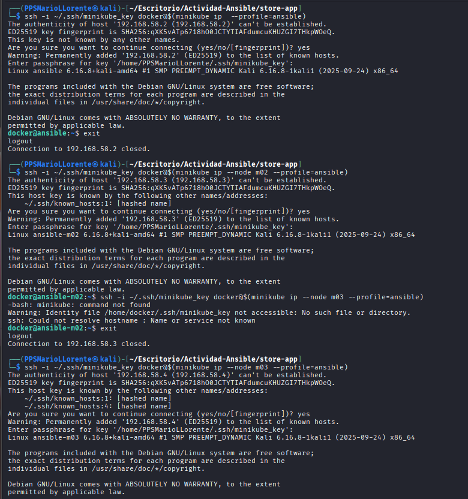
---
# CREAR INVENTARIO ANSIBLE

Recordamos que un `inventory` es un archivo donde tenemos el **nombre** e **ip** de un conjunto de nodos relacionados.
Vamos a crear el Inventario de hosts de nuestro despliegue: `inventory.ini` de manera automático con un script:


crea_inventory.sh
```bash
# Script que genera inventario por función
# IPs exactas: Almacenar las Ip de cada nodo en las variablesCONTROL_IP=$(minikube ip --profile=ansible)
CONTROL_IP=$(minikube ip --profile=ansible)
WORKER2_IP=$(minikube ip --node m02 --profile=ansible)
WORKER3_IP=$(minikube ip --node m03 --profile=ansible)

CONTROL_KEY=$(minikube ssh-key --profile=ansible)
WORKER2_KEY=$(minikube ssh-key --node m02 --profile=ansible)
WORKER3_KEY=$(minikube ssh-key --node m03 --profile=ansible)

cat > inventory.ini <<EOF
[control-plane]
ansible ansible_host=$CONTROL_IP ansible_user=docker ansible_ssh_private_key_file=$CONTROL_KEY

[app_nodes]
ansible-m02 ansible_host=$WORKER2_IP ansible_user=docker ansible_ssh_private_key_file=$WORKER2_KEY

[db_nodes]
ansible-m03 ansible_host=$WORKER3_IP ansible_user=docker ansible_ssh_private_key_file=$WORKER3_KEY

[all_workers:children]
db_nodes
app_nodes
EOF
```
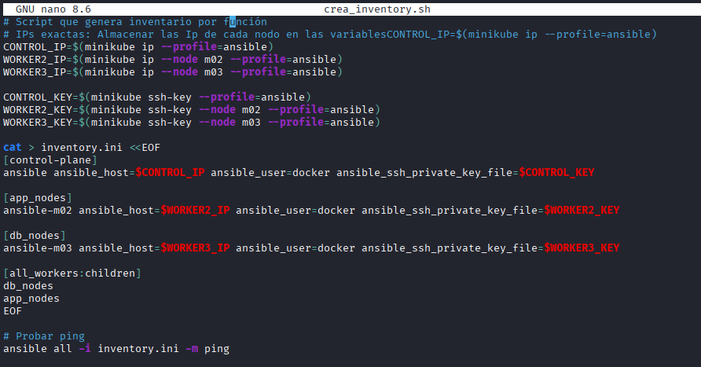


1. Crear el archivo `crea_inventory.sh`, introducimos el contenido, damos permisos y ejecutamos:

```bash
nano crea_inventory.sh
# pegar el contenido del script
# Ctrl + X para salir
# dar permisos de ejecución al script
chmod +x crea_inventory.sh
# ejecutar script
./crea_inventory.sh
# Probar ping
ansible all -i inventory.ini -m ping
```
La ejecución debe de dar algo así:

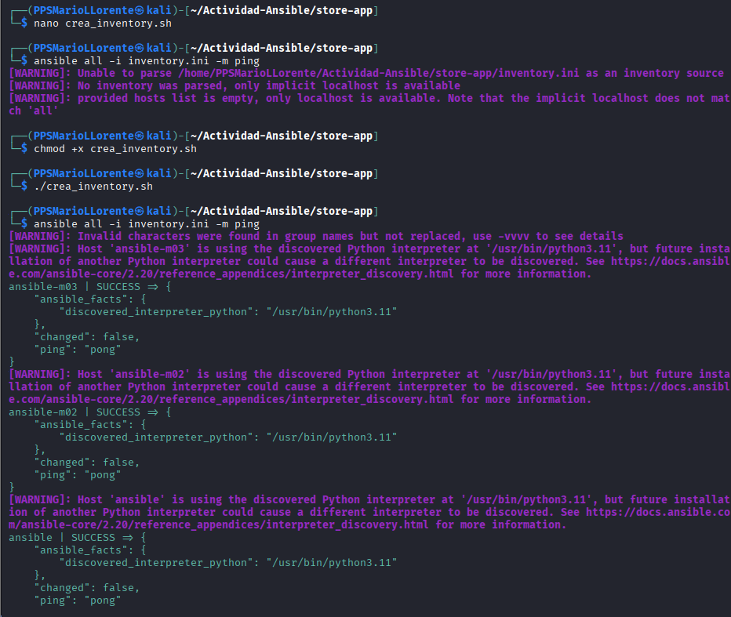

Y el `inventory.ini` quedará así

```conf
[control_plane]
k8s-control ansible_host=192.168.49.2 ansible_user=docker ansible_ssh_private_key_file=/home/PPS/.minikube/machines/ansible/id_rsa

[app_nodes]
k8s-worker2 ansible_host=192.168.49.3 ansible_user=docker ansible_ssh_private_key_file=/home/PPS/.minikube/machines/ansible-m02/id_rsa

[db_nodes]
k8s-worker3 ansible_host=192.168.49.4 ansible_user=docker ansible_ssh_private_key_file=/home/PPS/.minikube/machines/ansible-m03/id_rsa

[all_workers:children]
app_nodes
db_nodes
```
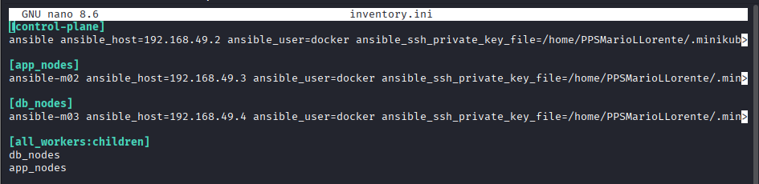


Si sale aviso de estar utilizando python 3.11... se puede silenciar con:

```bash
cat > ansible.cfg << 'EOF'
[defaults]
interpreter_python = auto_silent
EOF
```

2. Prueba:primer test Ansible

```bash
ansible-inventory -i inventory.ini --list
ansible all -i inventory.ini -m ping
```

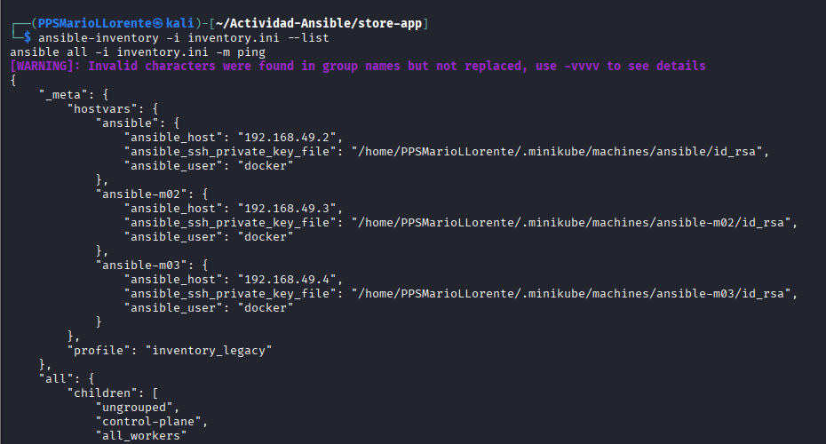

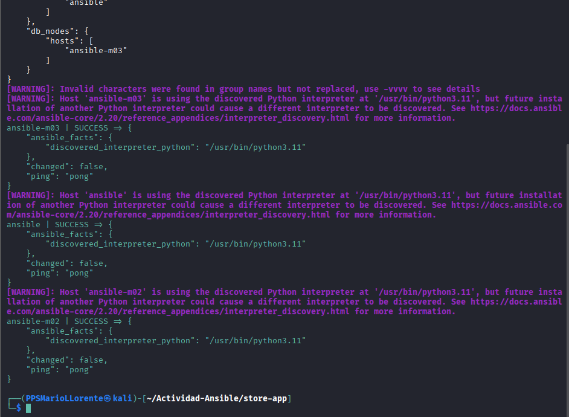


---
# EJECUTAR módulos ANSIBLE

Vamos a ver cómo hacemos algunas tareas con `Ansible`.

Vimos en los contenidos teóricos, que aunque hay muchos módulos, algunos de los más utilizados son:

- user.
- package.
- copy.
- file.
- service.
- template.
- command.
- shell.

Veamos algunos:

## Usuarios y grupos

Utilizamos los módulos **group** y **user**.

1. En el siguiente `playbook` **crear un usuario y un grupo** con nombre **maint** que realizará labores de mantenimiento en **todos los nodos**:

./create_maint_user.yml

```yaml
---
- name: Crear directorios de mantenimiento y desplegar clave publica
  hosts: all_workers
  become: yes

  vars:
    maint_user: maint
    local_public_key_file: ./maintain_key.pub

  tasks:
  - name: Crear grupo de mantenimiento
    ansible.builtin.group:
      name: maint
      state: present

  - name: Crear usuario de mantenimiento
    ansible.builtin.user:
      name: maint
      group: maint
      shell: /bin/bash
      create_home: yes
      state: present
```
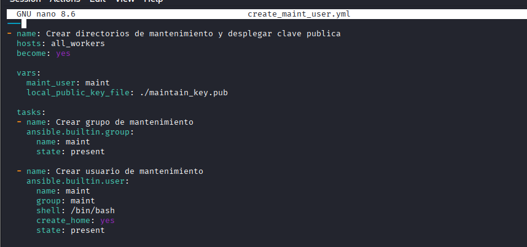

2. Ejecutar `playbook`:

```bash
ansible-playbook -i inventory.ini create_maint_user.yml
```
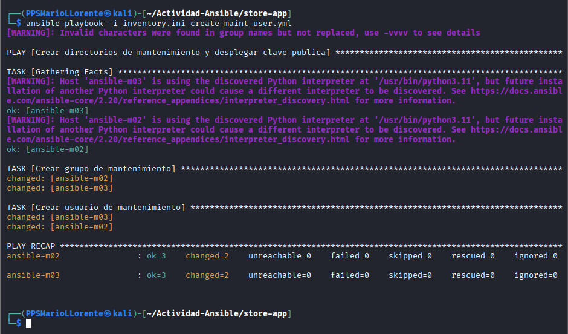

3. Comprobar que se han creado los usuarios. Lo podemos hacer con **Ansible** ya que todavía no le hemos pasado la clave ssh:

```bash
ansible all_workers -i inventory.ini -m shell -a "id maint"
```
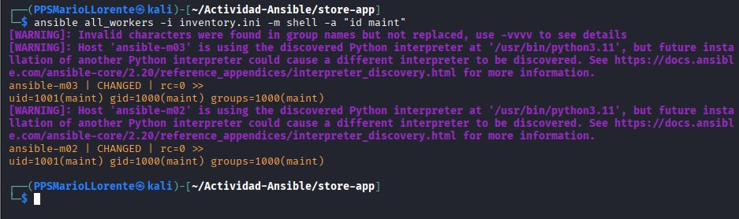


## File & copy

Vamos a ver cómo **crear directorios** y también vemos como **separar ejecución por etiquetas** de nodos: 
Para crear directorios:
  - /opt/appmaint/logs en nodo de app
  - /opt/dbmaint/backups

1. Crear el siguiente playbook:

```bash
nano manage_maint_files.yml
```

./manage_maint_files.yml
```yaml
---
  hosts: all_workers
  become: yes

  vars:
    maint_user: maint
    local_public_key_file: ./maintain_key.pub

  tasks:
    - name: Crear directorio de logs en nodos de aplicacion
      ansible.builtin.file:
        path: /opt/appmaint/logs
        state: directory
        owner: "{{ maint_user }}"
        group: "{{ maint_user }}"
        mode: '0755'
      when: "'app_nodes' in group_names"

    - name: Crear directorio de backups en nodos de base de datos
      ansible.builtin.file:
        path: /opt/dbmaint/backups
        state: directory
        owner: "{{ maint_user }}"
        group: "{{ maint_user }}"
        mode: '0750'
      when: "'db_nodes' in group_names"
```
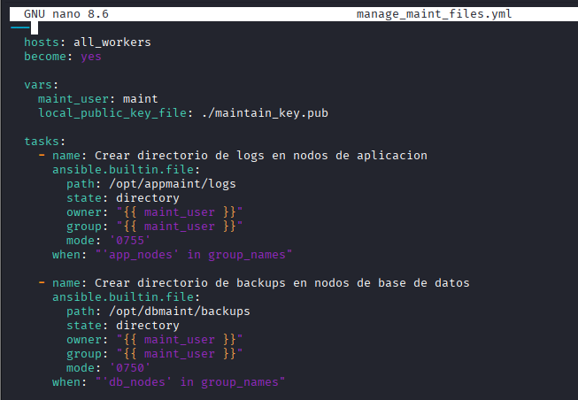

2. Ejecutar `playbook`:

```bash
 ansible-playbook -i inventory.ini manage_maint_files.yml
 ```
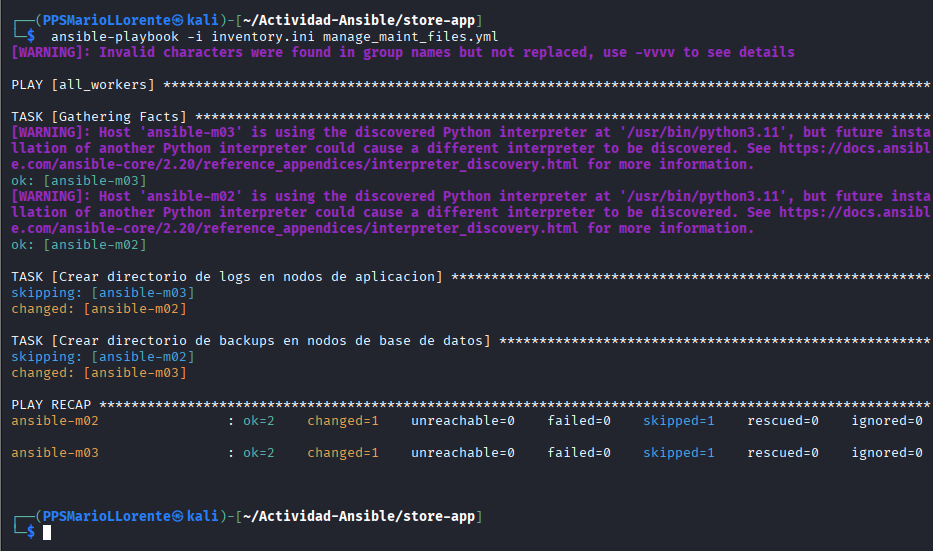

3. Comprobar ejecución:

```bash
# Nodos APP: solo /opt/appmaint
ansible app_nodes -i inventory.ini -m shell -a "ls -la /opt/appmaint/"

# Nodos DB: solo /opt/dbmaint  
ansible db_nodes -i inventory.ini -m shell -a "ls -la /opt/dbmaint/"
```
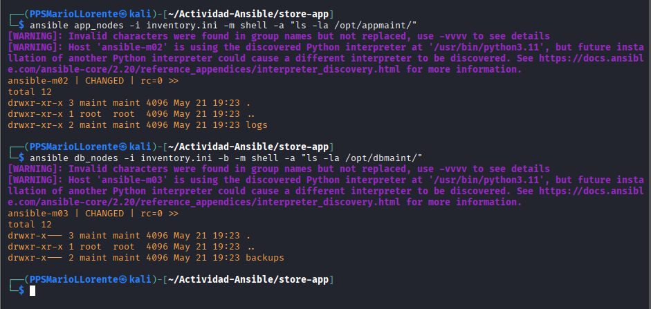

4. Descargar en la carpeta del proyecto el archivo de la clave pública que tenemos

5. Crear el siguiente playbook para añadir clave pública de usuario `maint` para que pueda conectarse a los nodos.:

```bash
nano manage_public_key_maint.yml
```

./manage_public_key_maint.yml
```yaml
---
- name: Anadir clave publica usuario maint
  hosts: all_workers
  become: yes

  vars:
    maint_user: maint
    local_public_key_file: ./maintain_key.pub

  tasks:
  
  - name: Crear carpeta .ssh del usuario
    ansible.builtin.file:
      path: /home/maint/.ssh
      state: directory
      owner: maint
      group: maint
      mode: '0700'

  - name: Copiar clave publica del usuario
    ansible.builtin.copy:
      src: ./maintain_key.pub
      dest: /home/maint/.ssh/maintain_key.pub
      owner: maint
      group: maint
      mode: '0644'

  - name: Autorizar la clave publica para acceso SSH
    ansible.posix.authorized_key:
      user: maint
      state: present
      key: "{{ lookup('file', './maintain_key.pub') }}"
      manage_dir: true
```

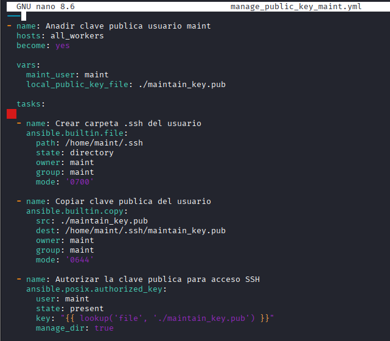

6. Ejecutar `playbook`
```bash
ansible-playbook -i inventory.ini manage_public_key_maint.yml
```

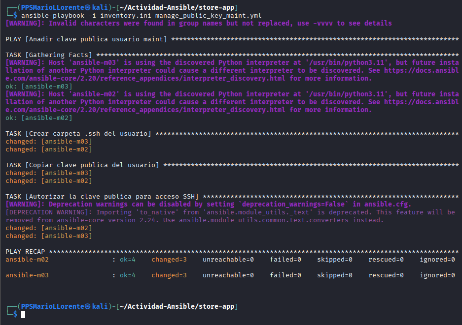

> Observamos como:
> - Creamos directorio .ssh para almacenar archivo de clave pública
> - Copiar cláve pública.
> - Añadirla al `authorized_keys`


5. **Copiamos la clave privada** que tenemos y la copiamos en el directorio .ssh de tu directorio personal: **/home/tu_usuario/.ssh/**. De esta manera cuando nos intentemos conectar por ssh como usuario **maint** nos dejará.

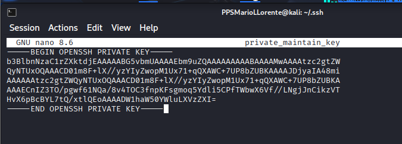

6. **Comprobamos las direcciones IP de los nodos y que nos deja conectar como usuario `maint`** en los nodos:

```bash
nano inventory.ini
# Comprueba que tienen las ip correctas
ssh -i ~/.ssh/maintain_key maint@192.168.49.3 "hostname; whoami; pwd"
ssh -i ~/.ssh/maintain_key maint@192.168.49.4 "hostname; whoami; pwd" 
```
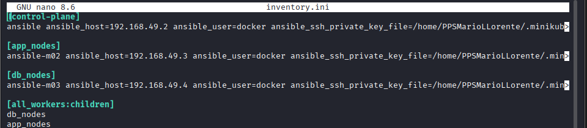

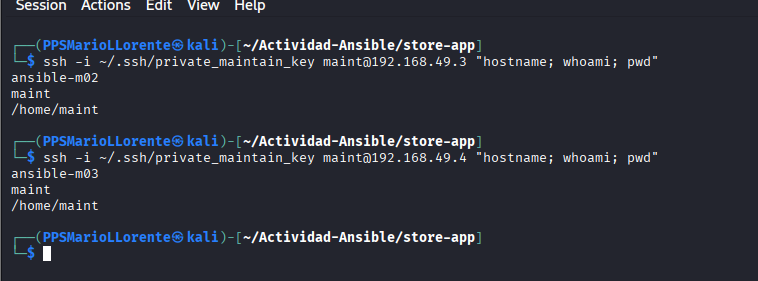

7. **Ejecutar** directamente módulo **file** desde `Ansible`:

```bash 
ansible all -i inventory.ini -m file -a "path=/home/maint/miDirectorio state=directory owner=maint group=maint mode='0700'--become"
```
> **--become** ejecuta como superusuario.

8. Como **ejecutar** directamente módulo **file**:

```bash
ansible all -i inventory.ini -m copy -a "src=./inventory.ini dest=/opt/inventory.ini mode=0644 owner=root group=root" -b
```


## Package

El módulo Package nos permite administrar el software.

Vamos a ver cómo podemos instalar software y también desinstalar. Tan sólo tenemos que modificar el **state** que puede tomar los valores: **absent, build-dep, fixed, latest, present**.

1. Crear el siguiente playbook para añadir clave pública de usuario `maint` para que pueda conectarse a los nodos.:

```bash
nano manage_public_key_maint.yml
```
El contenido es el siguiente

./manage_anadir_paquetes_maint.yml
```yaml
---
- name: Añadir software mantenimiento en  todos los nodos
  hosts: all_workers              # Se ejecuta en app_nodes y db_nodes
  become: yes                    # Necesario para crear usuarios
  tasks:
    - name: Instalar paquetes de mantenimiento
      package:
        name:
          - htop
          - tree
          - curl
          - jq
          - net-tools
        state: present
    - name: borrar paquete vim
      package:
        name:
          - vim
        state: absent

```
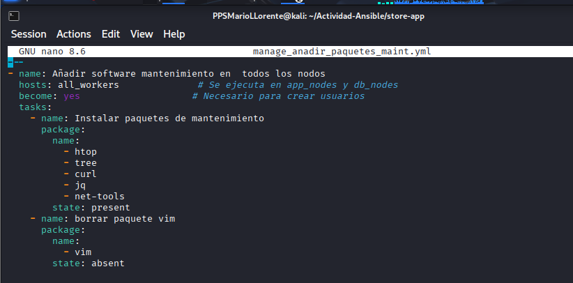

2. Ejecutar la tarea:

```bash
ansible-playbook -i inventory.ini manage_anadir_paquetes_maint.yml
```
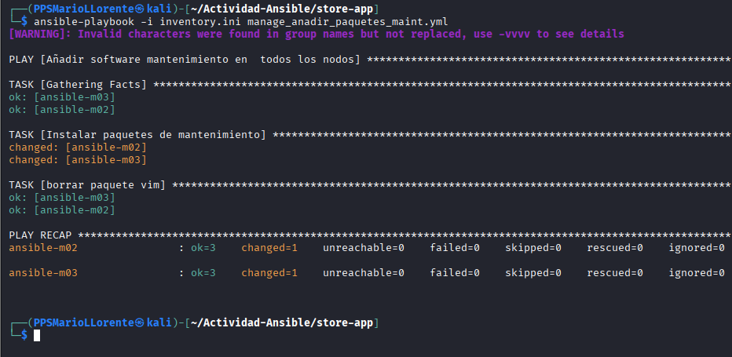

3. Comprobar si se han instalado los paquetes:

```bash
ansible all -i inventory.ini -m shell -a "hostname ; dpkg -l | grep -E 'htop|curl|tree|jq|net-tools|vim' "  
```

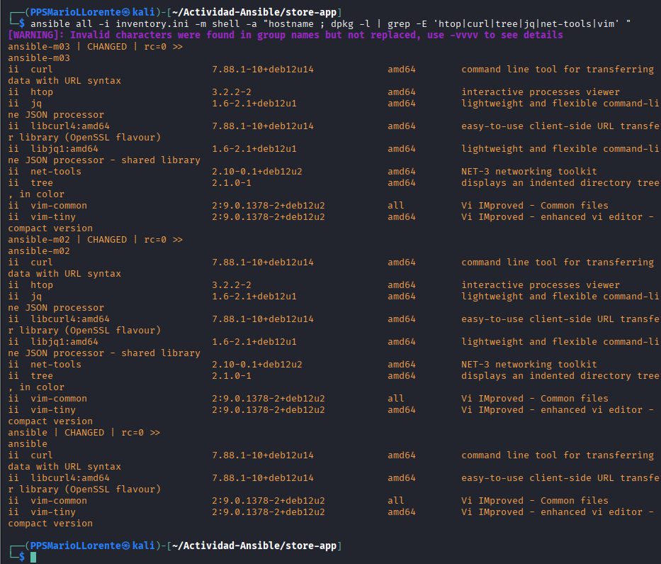

4. Instalar directamente desde Ansible:

```bash
# Ubuntu/Debian
ansible all -i inventory.ini -m apt -a "name=curl state=present"

# CentOS/RHEL
ansible all -i inventory.ini -m yum -a "name=curl state=present"
```


## Command & shell & services

**Command** y **shell** los utilizamos para ejecutar comandos en el nodo pero:
- Usar **shell** siempre excepto cuando usamos pipelines.
- Usar **command** cuando usamos pipelines.

**Service** para administrar servicios.

1. Crear el siguiente playbook para instalar nginx, levantar el servicio y comprobar que está ejecutándose:

```bash
nano manage_servicio_nginx.yml
```
El contenido es el siguiente

./manage_servicio_nginx.yml

```yaml
---
- name: Instalar y validar Nginx
  hosts: all_workers
  become: true

  tasks:
    - name: Paso 1 - Instalar Nginx
      ansible.builtin.apt:
        name: nginx
        state: present
        update_cache: yes

    - name: Paso 2A - Arrancar y habilitar Nginx
      ansible.builtin.service:
        name: nginx
        state: started
        enabled: yes

    - name: Paso 2B - Comprobar estado con command (sin pipes)
      ansible.builtin.command:
        cmd: systemctl status nginx

    - name: Paso 2C - Comprobar estado con shell (con pipes)
      ansible.builtin.shell:
        cmd: systemctl status nginx | grep Active
      register: nginx_status
      changed_when: false

    - name: Mostrar salida de status
      ansible.builtin.debug:
        var: nginx_status.stdout

    - name: Comprobar HTTP con uri
      ansible.builtin.uri:
        url: http://localhost:80
        status_code: 200
      register: http_check

    - name: Mostrar resultado HTTP
      ansible.builtin.debug:
        var: http_check.status
```
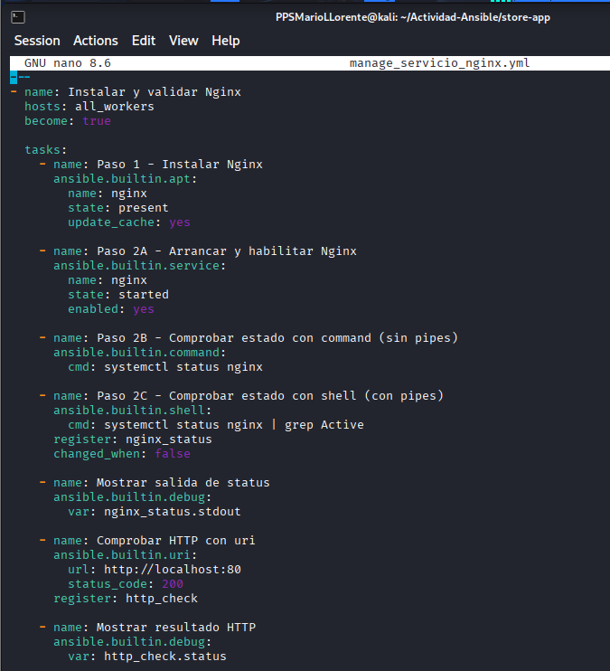

2. Ejecutar la tarea:

```bash
ansible-playbook -i inventory.ini manage_servicio_nginx.yml
```
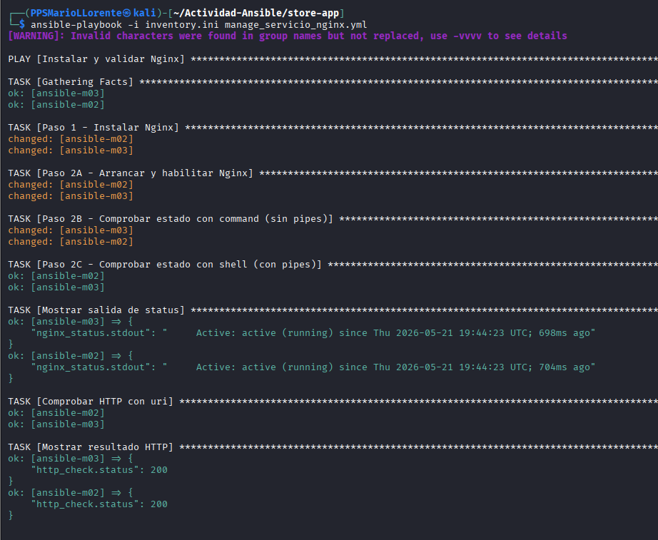

3. Aunque ya está dentro de la tarea, podemos comprobarlo:

```bash
ansible all -i inventory.ini -m shell -a "curl -s -o /dev/null -w '%{http_code}\\n' localhost:80 || echo 'ERROR' "  
```
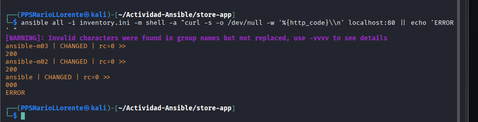

Si lo hubieramos querido realizar sin playbook:

```bash
# PASO 1: Instalar Nginx (MÓDULO service)
ansible all -i inventory.ini -m apt -a "name=nginx state=present update_cache=yes" -b

# PASO 2A: service (MÓDULO ESPECÍFICO - IDÉMPOTENTE)
ansible all -i inventory.ini -m service -a "name=nginx state=started enabled=yes" -b

# PASO 2B: command (FALLA con pipes... hay que usar shell)
ansible all -i inventory.ini -m command -a "systemctl status nginx | grep Active"

# PASO 2C: shell (FUNCIONA con pipes)
ansible all -i inventory.ini -m shell -a "systemctl status nginx | grep Active"

# PASO 3: Comprobar con curl si está levantado. 
ansible all -i inventory.ini -m shell -a "curl -s -o /dev/null -w '%{http_code}\n' localhost:80 || echo 'ERROR'"
```

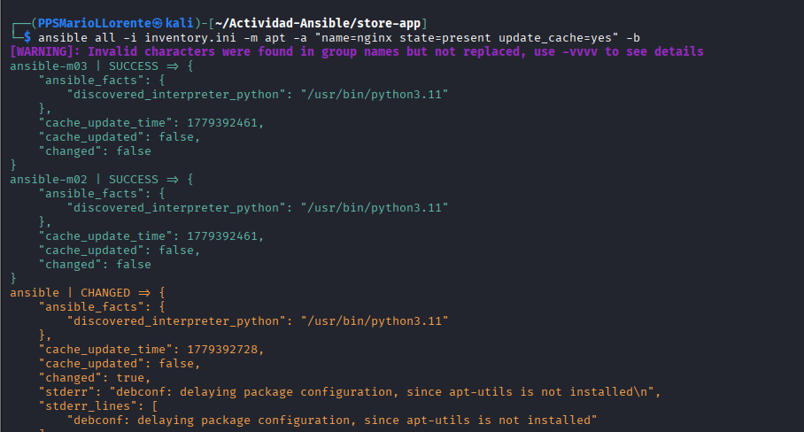

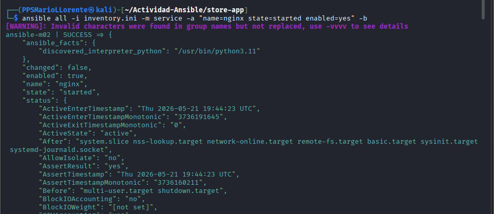

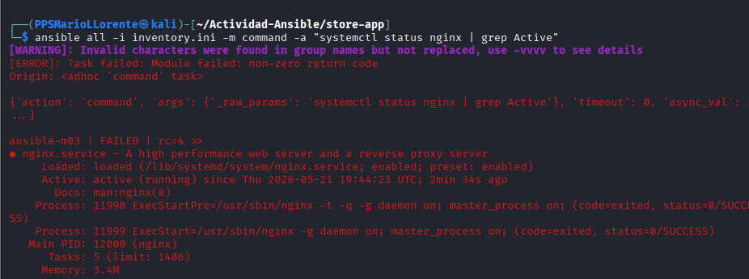

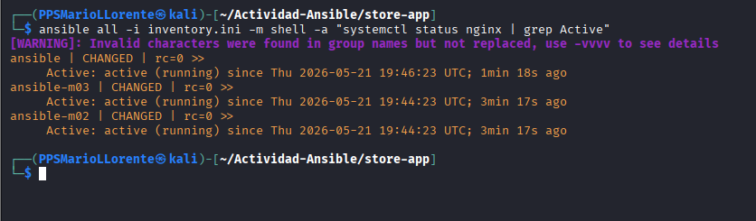

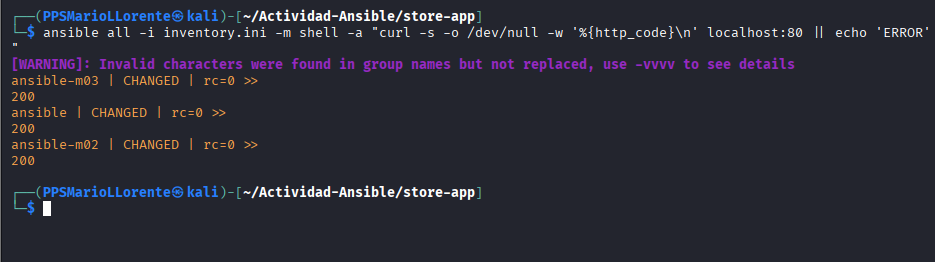

---
# ORGANIZACIÓN DE PROYECTOS EN ANSIBLE

Hasta ahora hemos visto como ejecutar directamente los módulos de `Ansible` y también mediante la creación de `playbooks`. Eso funciona pero cuando el proyecto crece:

* Docker
* usuarios
* firewall
* backups
* monitorización
* Kubernetes

el playbook acaba siendo enorme.

Por ello se suelen utilizar estructuras de este tipo:
```text
ansible-project/
│
├── inventory/
├── group_vars/
├── host_vars/
├── roles/
│   ├── nginx/
│   │   ├── tasks/
│   │   ├── handlers/
│   │   ├── templates/
│   │   ├── files/
│   │   ├── vars/
│   │   └── defaults/
│   │
│   └── mysql/
│
├── site.yml
└── ansible.cfg
```
donde:
- **inventory**: directorio donde se separan los hosts en inventarios, p.e.:

`store_app.ini` 
```ini
[web]
web01
web02

[db]
db01
```

- **Variables: host_vars y group_vars**: contienen archivos que contienen la declaración de variables que usaremos en los `playbooks`, p.e.:

`vars_store_app.yml`
```ini
vars:
  paquete: nginx
```

- **site.yml: Playbook Principal**: contiene las llamadas a diferentes roles.

---
# ROLES

Un rol es una forma estándar de organizar cosas relacionadas.

Por ejemplo:

Los roles nos permiten **separar configuración, despliegue, seguridad y monitorización** y además nos sirve para la **reutilización de las tareas** y mantener el proyecto limpio.

### Cómo crear un rol

Ansible tiene comando automático para crear la estructura de rol:

```bash
ansible-galaxy init nginx
```
Nos genera la estructura:

```text
roles/
└── nginx/
    ├── tasks/
    │   └── main.yml
    ├── handlers/
    │   └── main.yml
    ├── templates/
    ├── files/
    ├── vars/
    └── defaults/
```
En este caso el nombre del rol es **nginx**, donde:
- **tasks/**: las tareas, normalmente sólo `main.yml`.
- **handlers/**: son acciones que se ejecutan tras cambios, normalmente sólo `main.yml`.

- **templates/**: archivos Jinja2 dinámicos.

- **files/** archivos normales para copiar en los `playbooks`. 

- **vars/**: varialbes internas.
- **defaults/**: variable configurables.


Por ejemplo, el siguiente playbook en el que instalamos y configuramos nginx: 

`manage-create-ngins.yml`
```yaml
---
- hosts: web
  become: yes

  tasks:
    - name: Instalar nginx
      apt:
        name: nginx
        state: present

    - name: Copiar index.html
      copy:
        src: index.html
        dest: /var/www/html/index.html

    - name: Arrancar nginx
      service:
        name: nginx
        state: started
        enabled: yes
```
quedaría de la siguiente forma:

`site.yml`: 
```yaml
---
- hosts: app_nodes
  become: yes

  roles:
    - nginx
```

`roles/nginx/tasks/main.yml`
```yaml
---
- name: Instalar nginx
  apt:
    name: nginx
    state: present

- name: Copiar index.html
  copy:
    src: index.html
    dest: /var/www/html/index.html

- name: Arrancar nginx
  service:
    name: nginx
    state: started
    enabled: yes
```

- **ansible.cfg** es el archivo donde se definen los parámetros de funcionamiento de Ansible, p.e.

`ansible.cfg`
```yaml
[defaults]
inventory = inventory/inventory.ini
roles_path = roles
# silenciar las notificaciones de python
interpreter_python = auto_silent
```
De esta forma ejecutaríamos simplemente:

```bash
ansible-playbook site.yml
```

- **Playbook** → describe **QUÉ hacer** sobre unos hosts.
- **Rol** → organiza tareas relacionadas para reutilizarlas y mantener el proyecto limpio.

---
# DEJANDO TODO EN ÓRDEN
Para borrar el clúster luego:

```bash
# si te hace falta el siguiente comando es parar reiniciar el deployment
# kubectl rollout restart deployment store-app
# borramos el deployment
kubectl delete -f store-app-k8s.yaml
# comprobar que todo ha quedado limpio
kubecl get all
# parar minikube
minikube stop -p ansible
# borrar minikube
minikube delete -p ansible
```
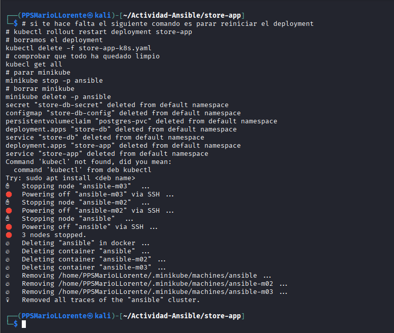